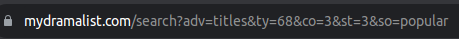

# EDA 프로젝트 7조 저장소 / 칠면조 / 주제 : 2015-2023년 한국 드라마 분석
---
## Requires
- [주요 라이브러리]  
```python
Python 3.10.12  
Pandas 2.0.3  
Matplotlib 3.7.2  
Seaborn 0.12.2  
BeautifulSoup 4.12.2  
PyQt5 5.15.9
NLTK 3.7  
scikit-learn 1.2.1   
WordCloud 1.9.2  
```

- [부가 라이브러리]  
```python
missingno  
koreanize_matplotlib  
user-agent  
tqdm  
mysql
```

---
## Directory
### data
- Datas from MyDramaList and Kaggle  

[MyDramaList](https://mydramalist.com/)  
[korean-drama-2015-23-actor-and-review(Kaggle)](https://www.kaggle.com/datasets/chanoncharuchinda/korean-drama-2015-23-actor-and-reviewmydramalist)  

### src

1. ```kdrama_2015_2023_ChoHongKi.ipynb```  - 조홍기
> 각자 데이터를 분석한 코드

2. ```kdrama_2015_2023_SeoYoungMoon.ipynb```  - 문서영
> 각자 데이터를 분석한 코드

3. ```kdrama_2015_2023_HanSeungJun.ipynb```  - 한승준
> 각자 데이터를 분석한 코드

4. ```mydramalist_crawling.ipynb```  - 조홍기
> MyDramaList 사이트에서 크롤링 하여 excel로 저장하는 코드

5. ```kdrama_preprocessing.ipynb```  - 조홍기
> ```mydramalist_crawling.ipynb``` 파일로 크롤링한 데이터를 전처리하는 코드

6. ```upload_to_aws.ipynb```  - 조홍기
> ```kdrama_preprocessing.ipynb``` 파일로 전처리까지 완료한 excel 파일을 aws에 업로드하는 코드

7. ```create_table_kdrama.sql```  - 문서영
> 데이터 업로드 할 MySQL 테이블 제작 쿼리

8. ```kinolights_crawling_pyqt.ipynb```  - 한승준
> [Kinolights](https://m.kinolights.com/ranking) 의 한국 드라마 랭킹을 크롤링 하여 GUI로 보여주는 코드

9. ```recommender_systems.ipynb```  - 한승준
> 드라마, 영화 추천 GUI 시스템 (with TF-IDF, Vader)

---
### trashcan
> 각자의 노력이 담겨있는 코드, 데이터들의 무덤

---

### etc

1. ```한국드라마분석_7조(칠면조).pptx```
> 2023.09.14에 발표한 PPT

---
## Description
__[설명]__  
해외에서 급성장 하고있는 K드라마.  
오징어게임의 흥행 이후 OTT 플랫폼을 바탕으로 K드라마는 급속도로 성장 중이며 올해 4월에는 넷플릭스는 한국에 향후 4년간 25억 달러를 투자하겠다고 발표했다.  
급속도로 성장하는 K드라마의 특징 등을 다방면적으로 분석한다.  

__[목표]__  
K드라마에 대해 전반적으로 분석하여 어떤 특징의 드라마가 흥행하는지 알아본다.
가능하면 추천 시스템 제작까지 진행.

### Sites

- MyDramaList 사이트


- 검색 리스트와 드라마 페이지는 크롤링을 막고 있지 않음.


- 드라마 리스트에는 다음과 같이 옵션을 지정할 수 있으며, url의 변수를 바꿔서 옵션을 바꿔줄 수 있음.



### Detail

